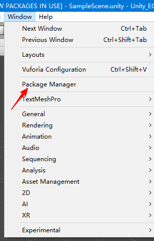
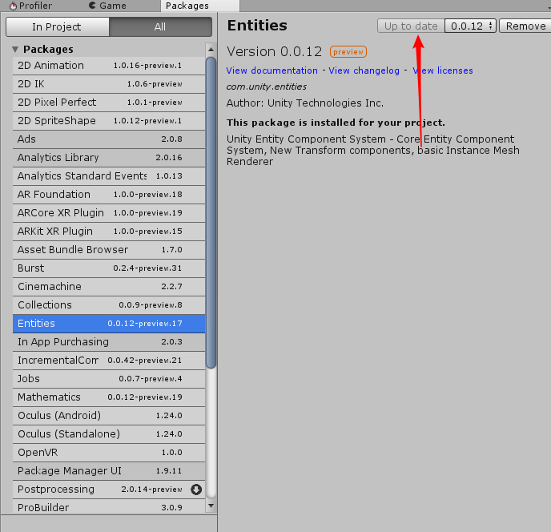
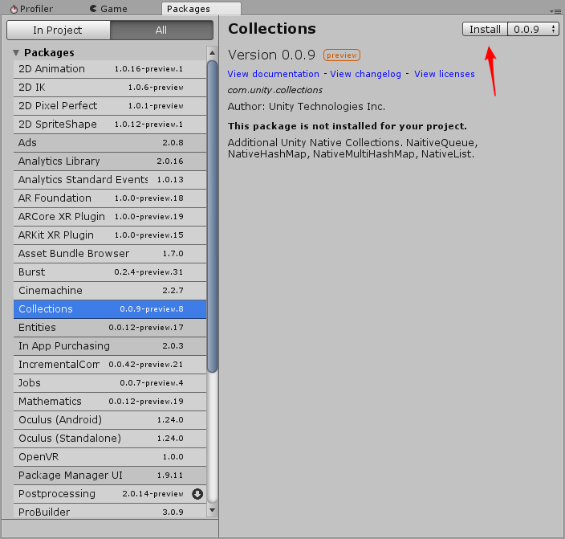

# Unity ECS Tutorials
The ECS Tutorials For Unity

## EN
### 1.How to open projects?
#### Open with Unity 2018.2.11f1

### 2.How to open Package Manager 
#### Window-> Package Manager

### 3.How to install new packages 
#### Window-> Package Manager -> All -> [Package name] -> update | Version

### 4.How to install new packages 
#### Window-> Package Manager -> All -> [Package name] -> Install | Version

